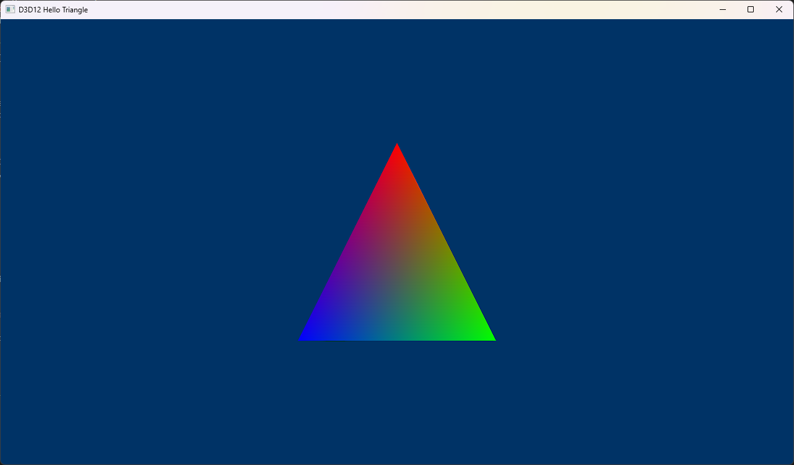

# Patronus

A from-scratch DirectX 12 renderer, built solo as a portfolio project and a
deep dive into modern GPU-driven rendering — command lists, resource
barriers, descriptor management, a particle system, and a render graph.
Windows, MSVC, C++20, HLSL Shader Model 6.6.

<!-- TODO: hero GIF of the renderer running -->


## Status

Early scaffolding. No rendering yet — see `docs/devlog/` for progress notes
and `docs/adr/` for the architectural decisions behind the current setup.

## Building

Requires Visual Studio 2022 (with the Desktop C++ workload) and CMake 3.28+.
Dependencies (DirectX Agility SDK, DXC, Tracy, Dear ImGui, D3D12MemoryAllocator)
are fetched automatically at configure time — no manual setup, but you'll
need network access the first time you configure.

```powershell
cmake --preset windows
cmake --build --preset debug           # or: release, relwithdebinfo
```

`RelWithDebInfo` is the profiling configuration — that's the one to use with
Tracy attached.

The build produces `PatronusSmokeTest.exe`, a diagnostic that creates a
D3D12 device, confirms the Agility SDK redistributable and debug layer are
active, and exits. It's a build-verification tool, not part of the
renderer.

## Benchmarks

<!-- TODO: benchmark results table / chart once the benchmark harness and
     a renderer exist to measure -->

_No results yet._

## Documentation

- [`docs/STYLE.md`](docs/STYLE.md) — code style, and where this project
  deviates from Google C++ Style and why.
- [`docs/adr/`](docs/adr/) — architecture decision records.
- [`docs/devlog/`](docs/devlog/) — development log.

## License

<!-- TODO -->
