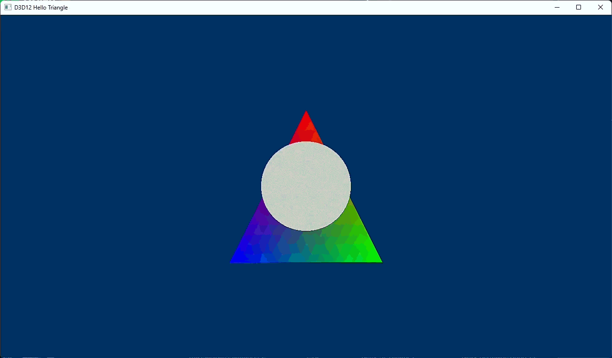
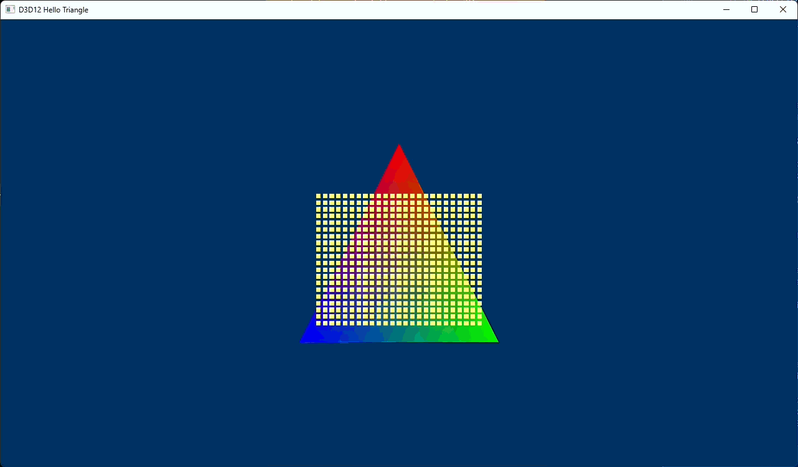

# Patronus

A from-scratch DirectX 12 renderer, built solo as a portfolio project and a
deep dive into modern GPU-driven rendering — a hand-rolled D3D12 frame
pipeline (command lists, resource barriers, descriptor management) and,
built on top of it, a GPU compute-driven particle system with 3D curl-noise
advection and vertex-pulled billboard rendering. Windows, MSVC, C++20,
HLSL Shader Model 6.6.



*3D curl-noise velocity field sampled per-particle in a compute shader,
plus a spherical attracting force pulling particles into an orbiting
shell — see [ADR-driven devlog: curl noise & mouse-look](docs/devlog/2026-09-15-curl-noise-and-mouse-look.md).*

## Status

Active development. The D3D12 frame pipeline (device/swap chain init,
frame synchronisation, tearing-aware fullscreen) is stable — see
[ADR-0002](docs/adr/0002-frames-in-flight.md) — and the current feature
focus is the GPU particle system shown above: a compute shader simulation,
curl-noise advection, and a vertex-pulled/billboarded renderer, driven by
a perspective camera with mouse-look controls.

All of that feature work currently lives under `src/core/`, which started
as Microsoft's `D3D12HelloTriangle` sample (vendored in for learning, see
[the first devlog entry](docs/devlog/2026-08-07-d3d12-fundamentals-and-ci-fixes.md))
and has since been extended substantially — camera, input, compute
particle sim, and curl-noise rendering are all additions on top of it.
`src/renderer/`, `src/rhi/`, and `shaders/` are scaffolded for the next
phase: migrating this feature set into a proper render-graph-based
renderer architecture, decoupled from the sample it started from.

## Implemented

**Core / frame pipeline**
- Frame synchronisation: separate backbuffer and frames-in-flight counts,
  each with its own index, and a two-point wait (frame latency waitable,
  then per-slot fence) before a command allocator is reset. See
  [ADR-0002](docs/adr/0002-frames-in-flight.md).
- Tearing-aware fullscreen toggle with coordinated swap chain resize. See
  [devlog: fullscreen toggle](docs/devlog/2026-08-14-fullscreen-toggle.md).
- High-precision frame timing (`QueryPerformanceCounter`) fed to the GPU
  through a root constant.

**Camera & input**
- Perspective camera (`Camera3D`) built on a small reusable
  `GameObject`/`GameObject3D` scene-object hierarchy.
- Mouse-look camera controls via a raw-input event queue (`Mouse`/`MouseEvent`).

**GPU particle simulation**
- Compute-shader particle system backed by a structured buffer, bound as
  a UAV to the compute shader and an SRV to the vertex shader — the
  particle data never round-trips through the CPU after the initial
  upload.
- Vertex pulling: billboarded particle quads are built entirely in the
  vertex shader from `SV_InstanceID`/`SV_VertexID`, with no vertex or
  index buffer bound at all.
- Semi-implicit (symplectic) Euler integration.
- 3D curl-noise velocity field, baked offline and sampled per-particle in
  the compute shader, plus a spherical attracting-band force and velocity
  damping producing the orbiting-shell effect above. See
  [devlog: GPU particle foundations](docs/devlog/2026-09-12-gpu-particle-foundations.md)
  and [devlog: curl noise & mouse-look](docs/devlog/2026-09-15-curl-noise-and-mouse-look.md).

**Tooling**
- Standalone curl-noise baking tool (`tools/curl noise generator/curlnoise.py`) —
  generates a divergence-free 64³ RGBA16F curl-noise volume from three
  seeded OpenSimplex fields and exports it as `.bin`/`.json`/`.png`.

## Timeline


*First particle rendering pass: vertex pulling and camera-facing billboards.*



*Semi-implicit Euler integration driving gravity-affected particles.*


*3D curl-noise advection with no attracting force — particles scatter
freely along the divergence-free field.*

## Building

Requires Visual Studio 2022 (with the Desktop C++ workload) and CMake 3.28+.
Dependencies (DirectX Agility SDK, DXC, Tracy, Dear ImGui, D3D12MemoryAllocator)
are fetched automatically at configure time — no manual setup, but you'll
need network access the first time you configure.

```powershell
cmake --preset windows
cmake --build --preset debug           # or: release, relwithdebinfo
```

`RelWithDebInfo` is the profiling configuration — that's the one to use with
Tracy attached.

The build produces two executables:

- **`D3D12HelloTriangle.exe`** — the actual demo: the GPU particle
  simulation, camera, and mouse-look controls described above. The
  quickest way to build and run it:

  ```powershell
  .\build_and_run.bat
  ```

  This builds the `Debug` configuration and launches the exe directly.

- **`PatronusSmokeTest.exe`** — a diagnostic that creates a D3D12 device,
  confirms the Agility SDK redistributable and debug layer are active,
  and exits. It's a build-verification tool, not part of the demo.

## Benchmarks

<!-- TODO: benchmark results table / chart once the benchmark harness and
     a renderer exist to measure -->

_No results yet._

## Documentation

- [`docs/STYLE.md`](docs/STYLE.md) — code style, and where this project
  deviates from Google C++ Style and why.
- [`docs/adr/`](docs/adr/) — architecture decision records.
- [`docs/devlog/`](docs/devlog/) — development log.

## License

This repository is public so it can be reviewed as a portfolio project.
No open-source license is granted — please don't copy, reuse, or
redistribute any part of it without asking me first and crediting the
original. Feel free to reach out if you'd like to use something from it.
