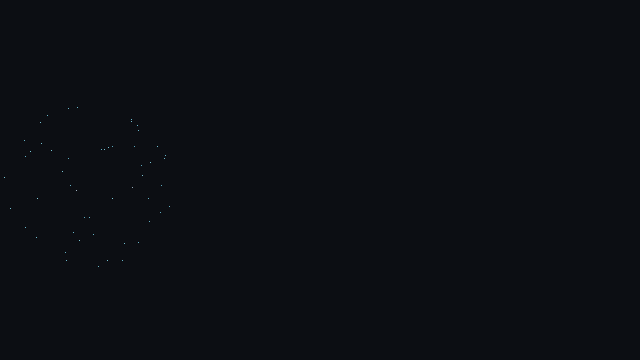

# Patronus

A from-scratch DirectX 12 renderer, built solo as a portfolio project and a
deep dive into modern GPU-driven rendering — a hand-rolled D3D12 frame
pipeline (command lists, resource barriers, descriptor management) and,
built on top of it, a GPU compute-driven particle system with 3D curl-noise
advection and vertex-pulled billboard rendering. Windows, MSVC, C++20,
HLSL Shader Model 6.6.


*3D curl-noise velocity field sampled per-particle in a compute shader,
plus a spherical attracting force pulling particles into an orbiting
shell — see [ADR-driven devlog: curl noise & mouse-look](docs/devlog/2026-09-15-curl-noise-and-mouse-look.md).*

## Status

Active development. The D3D12 frame pipeline (device/swap chain init,
frame synchronisation, tearing-aware fullscreen) is stable — see
[ADR-0002](docs/adr/0002-frames-in-flight.md) — and the current feature
focus is the GPU particle system shown above: a compute shader simulation,
curl-noise advection, and a vertex-pulled/billboarded renderer, driven by
a perspective camera with mouse-look controls.

All of that feature work currently lives under `src/core/`, which started
as Microsoft's `D3D12HelloTriangle` sample (vendored in for learning, see
[the first devlog entry](docs/devlog/2026-08-07-d3d12-fundamentals-and-ci-fixes.md))
and has since been extended substantially — camera, input, compute
particle sim, and curl-noise rendering are all additions on top of it.

Shaders live in `shaders/` and are compiled to Shader Model 6.6 by
`cmake/CompileShaders.cmake`. `src/renderer/vfx/` holds the skeleton of
the data-driven spell system that replaces the sample's particle code
(one `VfxSystem` facade, emitters as parameter rows, see
[ADR-0010](docs/adr/0010-data-driven-emitters.md)); its bodies are the
next milestones. The near-term plan is in [`docs/roadmap.md`](docs/roadmap.md).

## Implemented

**Core / frame pipeline**
- Frame synchronisation: separate backbuffer and frames-in-flight counts,
  each with its own index, and a two-point wait (frame latency waitable,
  then per-slot fence) before a command allocator is reset. See
  [ADR-0002](docs/adr/0002-frames-in-flight.md).
- Tearing-aware fullscreen toggle with coordinated swap chain resize. See
  [devlog: fullscreen toggle](docs/devlog/2026-08-14-fullscreen-toggle.md).
- High-precision frame timing (`QueryPerformanceCounter`) fed to the GPU
  through a root constant.

**Camera & input**
- Perspective camera (`Camera3D`) built on a small reusable
  `GameObject`/`GameObject3D` scene-object hierarchy.
- Mouse-look camera controls via a raw-input event queue (`Mouse`/`MouseEvent`).
- Keyboard (`src/platform/input/`) split by purpose: polled key state for
  movement, scaled by delta time, and a one-shot event queue for toggles
  (TAB fullscreen, V vsync) so a held key cannot flip a toggle every frame.

**Profiling & debug UI**
- GPU timing with D3D12 timestamp queries for the `frame`, `sim` and
  `render` zones, resolved into a per-frame readback region and read after
  the fence wait the frame loop already does, so no synchronisation is
  added. See [ADR-0011](docs/adr/0011-gpu-timestamp-measurement.md).
- `patronus::profiling::FrameTimingLog` (`src/profiling/`) writes the CSV
  that `tools/bench/bench_report.py` aggregates. Covered by a
  framework-free test in `tests/` that runs in CI.
- Dear ImGui (docking branch) via `cmake/DearImGui.cmake`, drawing from a
  descriptor slot reserved in the existing shader-visible heap.

**GPU particle simulation**
- Compute-shader particle system backed by a structured buffer, bound as
  a UAV to the compute shader and an SRV to the vertex shader — the
  particle data never round-trips through the CPU after the initial
  upload.
- Vertex pulling: billboarded particle quads are built entirely in the
  vertex shader from `SV_InstanceID`/`SV_VertexID`, with no vertex or
  index buffer bound at all.
- Semi-implicit (symplectic) Euler integration.
- 3D curl-noise velocity field, baked offline and sampled per-particle in
  the compute shader, plus a spherical attracting-band force and velocity
  damping producing the orbiting-shell effect above. See
  [devlog: GPU particle foundations](docs/devlog/2026-09-12-gpu-particle-foundations.md)
  and [devlog: curl noise & mouse-look](docs/devlog/2026-09-15-curl-noise-and-mouse-look.md).

**Tooling** (`tools/`, Python, numpy + matplotlib only)
- `bake_curl_noise.py` — tileable 64³ RGBA16F curl-noise volume (periodic
  lattice noise, wrapping curl stencil, divergence verified numerically),
  scalar noise in the alpha channel, `.bin`/`.json`/`.h`/`.png` outputs.
  Supersedes `tools/curl noise generator/curlnoise.py`, whose world-fixed,
  non-periodic field produced a seam under a WRAP sampler.
- `bake_noise2d.py` — tileable RGBA8 noise pack (Perlin fBm, Worley,
  fine Perlin, billow) for erosion, distortion and density in particle
  pixel shaders.
- `bake_curves.py` — bakes per-emitter size/alpha/colour curves from JSON
  into one RGBA16F atlas (`assets/curves/arcane_bolt.json` is the starting
  spec for the spell layers).
- `previs_spell.py` — CPU previsualisation of a spell spec: the same
  emitter logic, curve atlas, curl volume and premultiplied compositing the
  GPU version will use, rendered with numpy into a window, PNG frames or a
  GIF. Used to check the composition and to size the GPU pools before
  writing HLSL. Two specs so far: `assets/emitters/arcane_bolt.json` (a
  projectile orb) and `assets/emitters/force_vortex.json` (a horizontal
  blue-violet tornado in the Hogwarts Legacy Force-spell language: helical
  arms around the travel axis, a wavy rotating ring with two orbiting
  arcs, dust, and two line-drawn impact rings). Supports particle pools,
  a ring/helix spawn, a vortex force, and kinematic ring geometry. See
  [devlog: review, tooling and previs](docs/devlog/2026-09-18-review-tooling-and-spell-previs.md).
- `bench/bench_report.py` — percentiles, A/B deltas and plots from the
  timestamp CSV described in `tools/bench/README.md`.
- Baked outputs live in `assets/` and are copied next to the executable
  at build time.

## Target effects (CPU previs)



*Arcane bolt: charge, flight with trail and sparks, impact, dissipation.
Rendered by `tools/previs_spell.py` from `assets/emitters/arcane_bolt.json`;
this is the layout check for milestone M4, not renderer output.*


*Force vortex: helical arms, a wavy rotating ring with two orbiting arcs,
dust dragged in, then a flash and two line-drawn impact rings. Same tool,
`assets/emitters/force_vortex.json`.*

## Timeline


*First particle rendering pass: vertex pulling and camera-facing billboards.*


*Semi-implicit Euler integration driving gravity-affected particles.*


*3D curl-noise advection with no attracting force — particles scatter
freely along the divergence-free field.*

## Building

Requires Visual Studio 2022 (with the Desktop C++ workload) and CMake 3.28+.
Dependencies (DirectX Agility SDK, DXC, Tracy, Dear ImGui, D3D12MemoryAllocator)
are fetched automatically at configure time — no manual setup, but you'll
need network access the first time you configure.

```powershell
cmake --preset windows
cmake --build --preset debug           # or: release, relwithdebinfo
```

`RelWithDebInfo` is the profiling configuration — that's the one to use with
Tracy attached.

The build produces two executables:

- **`D3D12HelloTriangle.exe`** — the actual demo: the GPU particle
  simulation, camera, and mouse-look controls described above. The
  quickest way to build and run it:

  ```powershell
  .\build_and_run.bat
  ```

  This builds the `Debug` configuration and launches the exe directly.

- **`PatronusSmokeTest.exe`** — a diagnostic that creates a D3D12 device,
  confirms the Agility SDK redistributable and debug layer are active,
  and exits. It's a build-verification tool, not part of the demo.

## Benchmarks

The renderer times three GPU zones per frame with D3D12 timestamp queries:
`frame` (the whole command list), `sim` (the compute dispatch) and
`render` (the particle draw). Results are resolved into a readback buffer
and picked up two frames later, after a fence wait the frame loop performs
anyway, so measuring adds no CPU/GPU synchronisation — see
[ADR-0011](docs/adr/0011-gpu-timestamp-measurement.md). The samples are
written as CSV and aggregated by `tools/bench/bench_report.py`:

```powershell
cmake --build --preset relwithdebinfo
# run the demo, vsync off, camera fixed, then:
python tools/bench/bench_report.py benchmarks/runs/<name>.csv --warmup 60
```

### M0 baseline

1M particles, 1280x720, RelWithDebInfo, vsync off, fixed camera, AMD
Radeon RX 7800 XT. First 5000 frames skipped: the cloud expands from its
initial placement over roughly 3000 frames, and until it settles the draw
is measuring a smaller cloud.

| zone | p50 ms | p95 ms | p99 ms |
|---|---:|---:|---:|
| frame | 0.984 | 1.605 | 2.101 |
| sim | 0.092 | 0.172 | 0.239 |
| render | 0.828 | 1.121 | 1.165 |

### `DrawInstanced(4, N)` against `DrawIndexedInstanced(6N, 1)`

Inconclusive, and the reason is worth more than the number. `sim` is the
same compute shader in both runs and cannot be affected by the draw call,
so it works as a control:

| zone | instanced p50 | indexed p50 | delta |
|---|---:|---:|---:|
| sim (control, should not move) | 0.092 | 0.075 | -19.0% |
| render (under test) | 0.828 | 0.811 | -2.0% |

The control moved ten times more than the signal, so the two runs were not
taken under comparable GPU clock states and this pair cannot resolve a 2%
difference. At this billboard size the draw is fill-bound rather than
input-assembler bound, which is where an indexed quad list would pay off.
Rerun alternating the two paths inside one process, with the billboards
shrunk so that fill stops dominating. See
[devlog: M0](docs/devlog/2026-09-19-m0-measurable-baseline.md).

## Documentation

- [`docs/roadmap.md`](docs/roadmap.md) — milestones from the current orb to
  the finished spell, with what each one measures.
- [`docs/STYLE.md`](docs/STYLE.md) — code style, and where this project
  deviates from Google C++ Style and why.
- [`docs/adr/`](docs/adr/) — architecture decision records, including
  [ADR-0010](docs/adr/0010-data-driven-emitters.md) (data-driven emitters
  behind one facade) and
  [ADR-0011](docs/adr/0011-gpu-timestamp-measurement.md) (GPU timing
  method).
- [`docs/devlog/`](docs/devlog/) — development log.
- [`tools/bench/README.md`](tools/bench/README.md) — benchmark CSV schema
  and measurement hygiene.

## License

This repository is public so it can be reviewed as a portfolio project.
No open-source license is granted — please don't copy, reuse, or
redistribute any part of it without asking me first and crediting the
original. Feel free to reach out if you'd like to use something from it.
