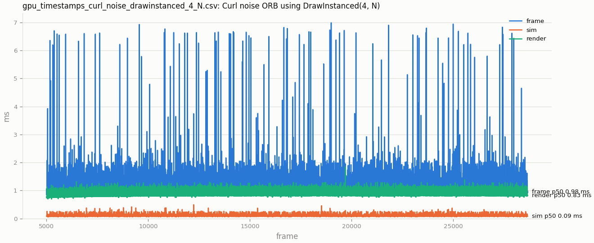

# 2026-09-19: M0, a correct and measurable baseline

*Closing out milestone M0 from `docs/roadmap.md`: the hazards found in the
2026-09-17 review are fixed, the renderer now reports GPU time to a CSV,
and there is a debug UI. No visual change, which is the point. Claude
wrote the CMake, the CSV writer and its test, and the documentation; the
D3D12 and input code is hand-written, as always.*

## What was wrong, and what it is now

**The camera constant buffer was a race.** One upload-heap buffer was
written by the CPU whenever the camera moved, while up to two frames in
flight could be reading it. It is now one slot per frame in flight,
written after that slot's fence wait in `BeginFrame`, unconditionally,
every frame. The unconditional part matters as much as the ring buffer: an
event-driven write leaves the other slot holding a stale snapshot, which
shows up as a one-frame camera jump whenever a frame receives no mouse
input.

The same rule now applies to everything the CPU writes per frame, and it
is the rule the spell system's emitter rows will follow (ADR-0010).

**Delta time was unclamped.** After a window drag or a debugger break, one
Euler step with a multi-second `dt` throws every particle out of the
field, and the velocity damping term `1 - saturate(5 * dt)` reaches zero
at 0.2 s and hides the explosion by freezing everything. Clamped to
0.1 s now.

**Upload buffers were kept for the life of the app.** The particle copy and
the curl-noise upload are now recorded into the initial command list and
their staging buffers released after the `WaitForGpu` in `LoadAssets`.
Releasing a `ComPtr` after merely *recording* a copy is not enough: D3D12,
unlike D3D11, does not keep a resource alive because a command list
references it.

## Input, rewritten around the right primitive

Keyboard and mouse moved to `src/platform/input/` and the two kinds of
input are now handled with the two mechanisms they need:

- **Polling** (`IsKeyPressed`) for movement. Held keys move the camera
  every frame, scaled by delta time.
- **Events** (`ReadKey`) for one-shot actions: TAB toggles fullscreen, V
  toggles vsync. With autorepeat off, the queue holds exactly one
  `KEY_DOWN` per physical press, so a held key cannot flip a toggle every
  frame.

Getting this backwards is a classic: polling a toggle hammers a swap chain
resize sixty times a second, and event-driving movement makes it feel
dead.

## Measurement

Three GPU zones are timed with timestamp queries: `frame`, `sim` and
`render`. The method and its one subtlety, reading the results back two
frames late so that no new CPU/GPU synchronisation is introduced, are in
[ADR-0011](../adr/0011-gpu-timestamp-measurement.md). Samples go through
`patronus::profiling::FrameTimingLog` into the CSV schema that
`tools/bench/bench_report.py` already consumed.

Dear ImGui (docking branch) is wired in, with its own CMake module. Its
font descriptor lives in a slot reserved inside the existing
shader-visible heap rather than in a second heap, so nothing else about
the frame changes. Two integration details were worth the time they cost:
the backend's descriptor-allocation callback is invoked lazily, at the
first `NewFrame`, so anything it captures must outlive `OnInit`; and the
Win32 message handler has to run before the app's own input handling, with
the app skipping input whenever `WantCaptureMouse` or
`WantCaptureKeyboard` is set.

## The first run measured the camera, not the renderer

The first full capture, 56 452 frames at 1280x720 with 1M particles on an
RX 7800 XT, aggregated to a `render` p50 of 0.353 ms. Plotting it showed
why that number is worthless: three regimes in one file. Segment medians:

| frames | `sim` p50 | `render` p50 |
|---|---:|---:|
| 5 000 to 20 000 | 0.090 ms | 0.996 ms |
| 30 000 to 45 000 | 0.063 ms | 0.124 ms |
| 52 000 to 56 000 | 0.079 ms | 0.366 ms |

`sim` moves by 40%, which is clock behaviour. `render` moves by a factor
of eight, because the camera was flown around during the run and the draw
is fill-bound: with the cloud off screen almost nothing rasterises, while
the vertex work stays. The aggregate p50 sits in the middle of a
distribution with three peaks and describes none of them.

`tools/bench/README.md` already said "fixed camera and deterministic seed
per scenario". The lesson is not that the rule exists, it is that a
percentile table cannot tell you the rule was broken, and a time-series
plot can in one glance.

## The recapture, and a control group that was there all along

Two clean runs followed, one per draw path, camera untouched. Both plot as
a single regime:

They also showed that `--warmup 60` was far too small:
the particle cloud expands from its initial placement for roughly 3000
frames, and until it settles the draw is rendering a smaller cloud. The
baseline in the README skips 5000.

The first reading of the A/B looked like a win for the indexed path. It
was not, and finding out why was the useful part.

| zone | instanced p50 | indexed p50 | delta |
|---|---:|---:|---:|
| `sim` | 0.092 ms | 0.075 ms | -19.0% |
| `render` | 0.828 ms | 0.811 ms | -2.0% |

`sim` is a compute dispatch over a fixed pool. It is byte-identical in the
two builds and the draw call cannot touch it, so any difference in it is
pure measurement noise. It moved 19% at p50 and 23% at p95. The zone
actually under test moved 2%, and its sign flips across the percentile
range: +11% at p5, -8% at p75.

So `sim` was an accidental control group, and it says the two runs sat at
different GPU clock states. A 2% effect cannot be read out of a
measurement whose noise floor is 19%. The honest result is that this pair
of runs does not resolve the question.

There is also a physical reason not to expect much here. An indexed quad
list helps when the input assembler is the bottleneck. At 1M particles
with billboards large enough to cover the screen many times over, the draw
is bound by rasterisation and pixel work, and the index buffer adds 24 MB
plus an index fetch per vertex to buy reuse of two shared corners. The
follow-up is to alternate the two paths inside one process, so they share
a thermal and clock state, with the billboards shrunk until fill stops
dominating.

Keeping a zone in every capture that the change under test cannot affect
is now the house rule. It costs one timestamp pair and it is the only
thing in the file that can tell you whether the rest of it means
anything.

## Parked deliberately

The FPS limiter in `HPTimer` and the four commented-out CPU placement
modes are left in place as comments for now. Tracy is skipped in favour of
the Visual Studio profiler and PIX. The ImGui window currently shows the
demo; the simulation sliders come with the emitter parameters in M2, where
there is something worth tuning.
